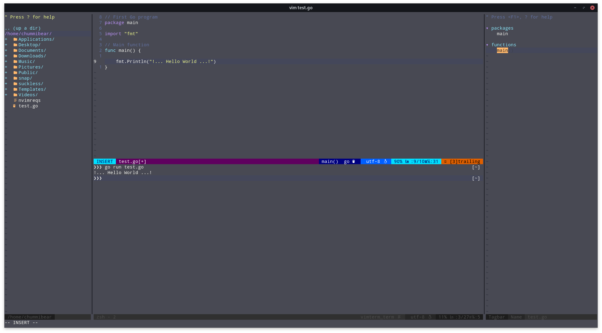

# Chumm's Neovim config

## Introduction

After going deep on emacs I thought why not give vim another chance. While I have used vim for years, I had never went too deep into the configuration. Past configs were 10 lines at most. This time, I decided to create something similar to what I had in emacs. This isn't a vim replacement for my emacs config nor is my emacs config a replacement for my vim config. Each function in their own way to get the job done.



## Installation
This only works in Neovim; however, it can be made to work in vim. Coc and ToggleTerm are only Neovim. If you are using vim and want a terminal you can comment out ToggleTerm and uncomment vim-terminal (and change the keybind).
There are a few requirements prior to using this config. The following need to be install on your system.

* vim-plug
* font-awesome or a Nerd tree patched font
* pip and neovim from pip (for python support needed for vim-terminal. Some distros come with it by default and some don't)
* ctags or exuberant-ctags for tagbar
* coc requries nodejs and npm installed

Copy the init.vim to ~/.config/nvim/
If the directory doesn't exist, create it.
Install vim-plug (check their git for how to install)
Run nvim and execute the following.
```vim
:PlugInstall
```
quit nvim and go cd to ~/.config/nvim/plugged/coc.nvim/
run the following commands (you should have nodejs and npm installed before this point).
This will install yarn.
```bash
sudo npm istall -g yarn
```
The rest will use yarn to install and build out the coc plugin.
```bash
yarn install && yarn build
```
Once that is done you may need to go back into nvim and do another PlugInstall.
Coc will need modules installed for each programming language that you wish to use. Below is an example for Python.

In nvim execute the following to install the coc module for python
```vim
:CocInstall coc-python
```
You will still need a python back end so this will need to be run in the terminal (pip in needed for this if you didn't install it earlier do so prior to running this).
```bash
pip install jedi
```

That should be it.
